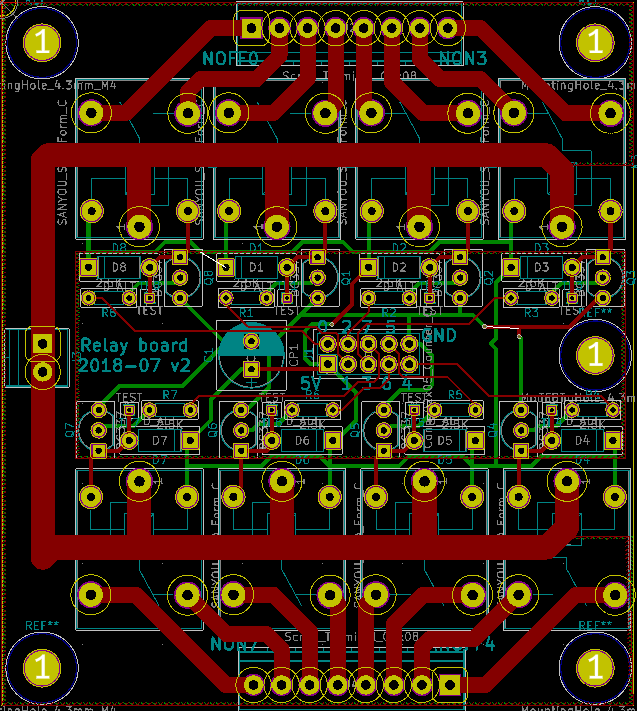

# pcb-relay-board-2
Printed Circuit Board for 5V Relays x8

## Bill of Materials

* Compatible relays: 5V coil / 230V-10A
  * Songle SRD-5VDC-SL-C
  * Zetter AZ943-1CH-5DE 
  * Hongfa HF3FA/005-ZT
  * Omron G5LE-1
  * Panasonic JS1-5V-F
* Transistors: BC337 or compatible (CBE layout)
* Diodes: 1N4148 or similar
* Resistors: 5K
* Capacitor: 100uF

## J1 connector pinout
| Function | Pin | Pin | Function |
| --- | --- | --- | --- |
| 5V | 1 | 2  | Relay 0  |
| Relay 1 | 3 | 4  | Relay 2  |
| Relay 3 | 5 | 6  | Relay 7  |
| Relay 4 | 7 | 8  | Relay 5  |
| Relay 5 | 9 | 10 | GND  |

## Errata

* On the silscreen, Normally on and Normally off indications (NONx and NOFFx respectively are reversed)
